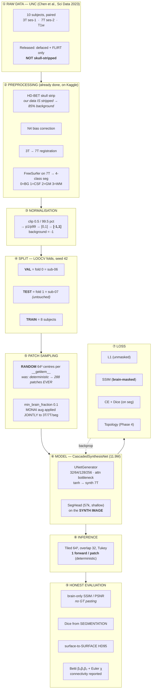
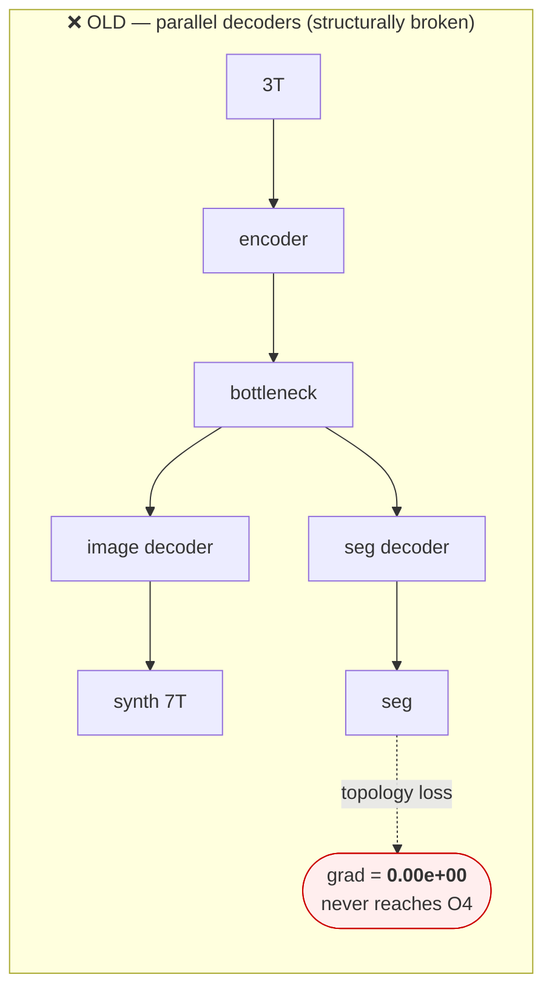
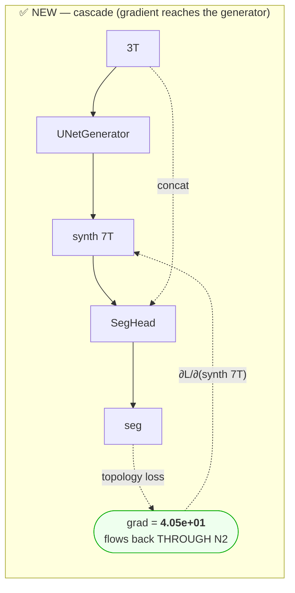
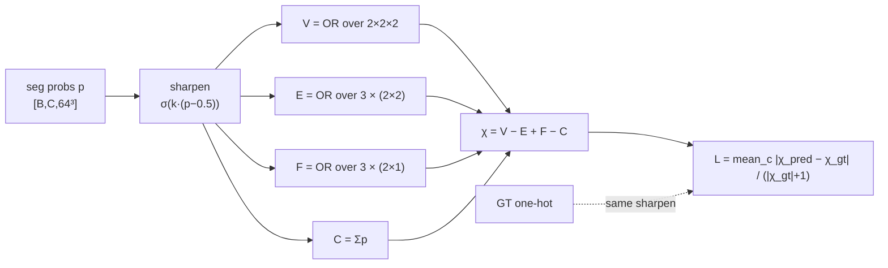

# Architecture & Pipeline — the rebuilt system

Verified end-to-end, 13 July 2026. Every stage below has been traced against the code and,
where it matters, asserted by a test in `scripts/`.

---

## 1. The whole pipeline

---

## 2. The model — why it CASCADES instead of branching

This is the single most important design decision, and it is what the old model got wrong.

**Measured** (`scripts/test_cascaded_gradient.py`), after `loss_seg.backward()`:

| | image decoder `.ups` | image head `.outc` |
|---|---|---|
| OLD (parallel) | `0.0000e+00` — grad is **None for 42/42 params** | `0.0000e+00` |
| NEW (cascade) | **`4.0537e+01`** — grad for 42/42 | **`2.7437e-02`** |

Because `seg = SegHead(synth_image)`, any loss on the segmentation **must** backpropagate through
the generator. The network is therefore forced to synthesise an image that *is segmentable with
the correct anatomy*. That is what "topology-aware synthesis" was always supposed to mean, and in
the old design it was **impossible**.

The `detach_seg_input=True` flag reproduces the broken behaviour exactly (verified `0.00e+00`), so
the paper can **ablate this precise design choice** rather than merely assert it.

**Why the SegHead is deliberately shallow (57k params):** it is a *probe*, not a segmenter. If it
were powerful it could compensate for a bad image and let the generator off the hook — exactly the
failure mode we are eliminating.

---

## 3. The topology loss — what it actually is

The published "topology loss" was **not topological**: edge-weighted CE + a Dice on Sobel edges.
No Betti number, no connectivity, no persistence. FS-RWKV and LiteMamba-Synth use the same
L1+SSIM+Sobel recipe on this exact task and do not call it topology.

The replacement is the **Euler characteristic of the cubical complex** — a genuine topological
invariant:

$$\chi = \beta_0 - \beta_1 + \beta_2 = V - E + F - C$$

Each of $V,E,F,C$ counts grid elements covered by ≥1 foreground voxel — a local OR over a small
window — so all four are seven `conv3d` ops with an all-ones kernel. The probabilistic OR
$1-\prod_i(1-p_i)$ is exact on binary input and smooth on soft input.

### Two bugs found and fixed while building it (both were silent)

**1. `clamp` is a dead-gradient trap.** The natural `(1-p).clamp(min=eps)` has **zero gradient
below its floor**, so the moment the model becomes confident the topology loss silently stops
producing *any* gradient — measured `|grad| = 0.0000`. This is the same failure mode as the old
perceptual loss's `clamp(loss, max=10)`. Fixed with an affine squeeze `p → p(1−2ε)+ε`, whose
derivative is ≈1 everywhere.

**2. Unsharpened, the loss preferred a BROKEN shape.** χ as computed is an *expected* χ (the
soft-OR is literally P(window has ≥1 foreground)), so every uncertain background voxel is an
**expected spurious component**. On the test volume that background speckle contributes +0.62 to
χ — the same order as a real topological error — and it **numerically cancels** a missing handle
(−1). Measured, with no sharpening:

| | solid cube (topology CORRECT) | cube + tunnel (topology BROKEN) |
|---|---|---|
| sharpness = 0 | 0.2659 | **0.2363** ← the broken shape *wins* |
| **sharpness = 20** | **0.0000** | 0.4824 ✅ |

An unsharpened Euler loss will happily **trade a hole against speckle**. Sharpening
$p \mapsto \sigma(k(p-0.5))$ pushes confident background to ~0 so it stops manufacturing
components, and its gradient $k\sigma(1-\sigma)$ is **largest exactly at $p=0.5$** — the decision
boundary, the only place topology can actually change. The same map is applied to the GT so the
residual bias cancels.

### The limitation, stated (not buried)

χ **conflates** β₀, β₁, β₂. Two separate balls (β₀=2) and one hollow shell (β₀=1, β₂=1) **both
have χ=2** — an Euler loss cannot tell them apart. This is inherent to the invariant (Li et al.,
IEEE TMI 2025 carry the same caveat). Two consequences, both honoured in the code:

- it is a **regulariser on top of CE+Dice**, which anchor the shape — never a standalone objective;
- **evaluation reports β₀/β₁/β₂ separately** (`src/metrics_honest.py`), so the claim is tested by
  a metric **strictly stronger than the loss being optimised**.

The loss is also **not monotone** through p=0.5 (at a coin-flip every voxel is expected structure).
Real, documented, and the reason for the warm-up.

### Calibration — why `--topo-warmup` is mandatory

At random init the segmentation is near-uniform, so E[χ] counts ~1,750 expected spurious
components per class: **χ_pred ≈ 2149 vs χ_gt ≈ 12, L_topo = 189**. Switching the term on cold
would swamp L1+CE by ~10×. Guards: `--topo-warmup 10000` (ramp in once the seg head is sane) and
the existing `clip_grad_norm_(1.0)`. By warm-up, CE ≈ 0.16 and L_topo lands at O(1).

**Cost: free** — measured ~0 % added step time (7 conv3d with an all-ones kernel is memory-bound
and trivial next to the U-Net forward).

---

## 4. Verified facts (each asserted by a test)

| Claim | Test | Result |
|---|---|---|
| Patch centres are random | `test_dataset_fixes.py` | 32 → **4,707** distinct (147×) |
| Folds are idempotent | `test_dataset_fixes.py` | all 10 subjects validated exactly once |
| val ≠ test | `test_dataset_fixes.py` | val=sub-06, test=sub-07, **train = 8** |
| Topology grad reaches generator | `test_cascaded_gradient.py` | `0.00e+00` → `4.05e+01` |
| Pasting GT changes nothing | `test_metrics_honest.py` | Δ = **exactly 0** |
| Perfect prediction → HD95 0 | `test_metrics_honest.py` | `0.000 mm` (old: 1.0) |
| Old HD95 rewards fragmentation | `test_metrics_honest.py` | sponge: fake **1.0 mm** vs honest **11.4 mm** |
| Ablation flags really ablate | `test_topo_ablation_flags.py` | each flag changes the loss |
| χ is a **real** invariant | `test_topology_euler.py` | exact on ball/shell/torus, **agrees with gudhi PH** |
| χ loss gradient repairs topology | `test_topology_euler.py` | grad closes the handle; correct shape scores 0.0 vs broken 0.48 |
| **Naive χ loss is unusable** | `test_topology_euler.py` | unsharpened, the **broken** shape wins (0.236 < 0.266) |
| χ loss reaches the generator | `test_topo_reaches_generator.py` | `0.00e+00` → **`4.61e+01`**, 44/44 params |
| Finite + affordable at 64³ | `test_topo_train_step.py` | finite; **~0 %** added step time |

---

## 5. Known limitations (stated, not hidden)

1. **Train = 8 subjects** (not 9). Honouring `test_fold` costs one training subject. The cascaded
   model still beat B1 by +1.29 dB **with 11 % less training data**.
2. **Our data is skull-stripped; the UNC release is not.** Every published competitor synthesises
   full-head volumes. Our numbers are therefore **not** directly comparable to theirs — see
   `BENCHMARK_REALITY.md`. A literal head-to-head requires reproducing their protocol.
3. **~85 % of each volume is constant background.** This diluted the SSIM term ~2× until it was
   brain-masked (`check_brainfrac.py`: accepted patches are only ~50 % brain on average).
4. **Patch-level topology ≠ volume-level topology.** A topology loss on 64³ patches regularises
   local topology; the global Betti numbers are measured at evaluation.
5. **Brain-only SSIM is flat** (0.444 → 0.450). Either undertraining (16.7k/40k, LR never
   annealed) or the perception–distortion wall. Unresolved.

---

## 6. Where the numbers stand

| System | whole-vol PSNR | brain SSIM | GM Dice | brain HD95 |
|---|---|---|---|---|
| Old TopoBrain (honest metrics) | 9.45 dB | 0.071 | 0.782 | 49.45 mm |
| Old TopoBrain (**as published**) | *20.00 dB* | *0.8991* | — | *2.05 mm* |
| B1 regression (9 train subj) | 20.24 dB | 0.444 | 0.874 | 4.11 mm |
| **Cascaded (8 train subj, 40 % trained)** | **21.53 dB** | 0.450 | 0.875 | **3.31 mm** |
| *Benchmark: Acs & Zhuang 2025* | *23.25 dB* | — | — | — |

The published row is what the old evaluation harness reported. The row above it is what the same
model actually achieves when measured honestly.
